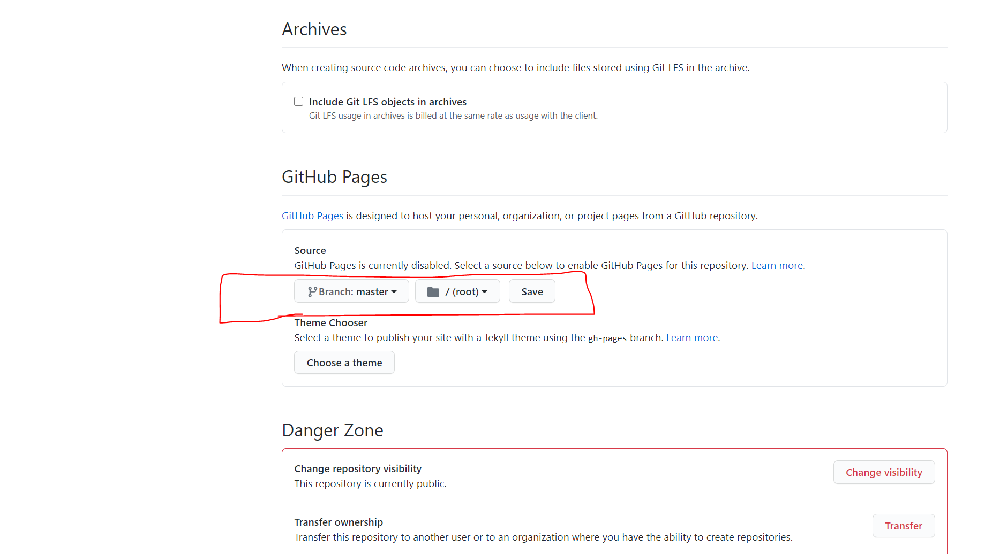

<div align="center">
  <h1> Git ve GitHub Öyrənmək</h1>
   <a class="header-badge" target="_blank" href="https://twitter.com/DeveloperKhatai">
  
  </a>

<sub>Çevirmen:
<a href="https://www.github.com/BilgeGates" target="_blank">Khatai Huseynzade</a><br>
<small>Mayıs, 2023</small>
</sub>

</div>

### _*Çevirmen Notu*_: 10 Days Of Git and Github kılavuzunu yaratdığı üçün <a href="https://github.com/Asabeneh">Asabeneh Yetahyeh</a>'e teşekkür ederiz!

- [Git və GitHub Öyrənmək](#Git-və-GitHub-Öyrənmək)
  - [Əsas Komanda Sətirləri](#Əsas-Komanda-Sətirləri)
    - [Cari İş Kataloqu](#Cari-İş-Kataloqu)
    - [Naviqasiya Kataloqu](#Naviqasiya-Kataloqu)
    - [Kataloq Yaratmaq](#Kataloq-Yaratmaq)
    - [Faylların və Qovluqların Siyahısı](#Faylların-və-Qovluqların-Siyahısı)
    - [Ətraflı Siyahı](#Ətraflı-Siyahı)
    - [Fayl Yaratmaq](#Fayl-Yaratmaq)
    - [Faylın Açılması və Yazılması](#Faylın-Açılması-və-Yazılması)
    - [Oxumaq Üçün Faylı Açmaq](#Oxumaq-Üçün-Faylı-Açmaq)
    - [Faylı Kopyalamaq](#Faylı-Kopyalamaq)
    - [Faylın Adını Dəyişmək](#Faylın-Adını-Dəyişmək)
    - [Daşınan Fayl və Kataloq](#Daşınan-Fayl-və-Kataloq)
    - [Fayl və Kataloqu Silmək](#Fayl-və-Kataloqu-Silmək)
  - [Git və GitHub](#Git-ve-GitHub)
    - [Giti Quraşdırmaq](#Giti-Quraşdırmaq)
    - [Repozitoriyanın Statusu Yoxlamaq](#Repozitoriyanın-Statusu-Yoxlamaq)
    - [Ad və e-poçtu Konfiqurasiya Etmək](#Ad-və-e-poçtu-Konfiqurasiya-Etmək)
    - [Yerli Git Deposu Yaratmaq](#Yerli-Git-Deposu-Yaratmaq)
    - [Giti işə Salmaq](#Giti-İşə-Salmaq)
    - [Səhnə Sahəsinə Fayl Əlavə Etmək](#Səhnə-Sahəsinə-Fayl-Əlavə-Etmək)
    - [Faylı Səhnədən Çıxarmaq](Faylı-Səhnədən-Çıxarmaq)
    - [Dəyişikliklərə Yerinə Yetirmək](#Dəyişiklikləri-Yerinə-Yetirmək)
    - [Git Jurnalı](#Git-Jurnalı)
      - [Bir Xətt](#Bir-Xətt)
      - [Limit](#Limit)
      - [Yoxlamaq](#Yoxlamaq)
  - [Filial Yaratmaq](#Filial-Yaratmaq)
  - [GitHubda Hesab Yaratmaq](#GitHubda-Hesab-Yaratmaq)
  - [GitHubda Repozitoriya Yaratmaq](#GitHubda-Repozitoriya-Yaratmaq)
  - [Gitin Uzaq Depo ilə Əlaqələndirilməsi](#Gitin-Uzaq-Depo-ilə-Əlaqələndirilməsi)
  - [İtələmək](İtələmək)
  - [Birləşdirmə](#Birləşdirmə)
  - [Çəkmək](#Çəkmək)
  - [Git Klonu](#Git-Klonu)
  - [Filialın Adını dəyişdirmək](#Filialın-Adını-dəyişdirmək)
  - [Filialı Silmək](#Filialı-Silmək)
  - [gitignore Faylı](#gitignore-Faylı)
  - [Boşalma](#Boşalma)
  - [Git fırıldaqçı hesabatı](#Git-Fırıldaqçı-Hesabatı)
  - [Git Repozitoriyasının İstifadəçi İnterfeysi Xüsusiyyətləri](#Git-Repozitoriyasının-İstifadəçi-İnterfeysi-Xüsusiyyətləri)
  - [GitHub Səhifəsi](#GitHub-Səhifəsi)
  - [GitHubda Sənədləşmə](#GitHubda-Sənədləşmə)
  - [GitHub Sənədlərini İşarələməmək](#GitHub-Sənədlərini-İşarələmək)
  - [GitHub Wiki](#GitHub-Wiki)
  - [GitHubda Əməkdaşlıq](#GitHubda-Əməkdaşlıq)

## Əsas Komanda Sətirləri

Tərtibatçılar əsas Unix əmrlərini bilməlidirlər. Lazım olan bəzi tapşırıqları git bash, mac terminal və ya pəncərə əmr sorğusundan istifadə etməklə yerinə yetirmək lazımdır. Bu dərslikdə biz Git Bashdan istifadə edərək, bir tərtibatçı kimi sizə lazım ola biləcək Unix əmrinin əsaslarını öyrənəcəyik. Bu tam siyahı deyil, lakin gündəlik istifadə üçün kifayətdir. Git Bashdan istifadə etmək üçün əvvəlcə [git](https://git-scm.com/) quraşdırmalısınız. Quraşdırmanın sonuna qədər növbəti düyməni sıxmaqla quraşdıra bilərsiniz.

Dərsliyi izləmək istəyirsinizsə, bu [linkə klikləyin.] (https://www.youtube.com/watch?v=9cCApTLb_Io&list=PLbvhRHYrmshSCAHZbibqh_px_LxnU54dk)

### Cari İş Kataloqu

_pwd_ əmrindən istifadə edərək işçi qovluğunun yoxlanılması.

```ş
Asabeneh@DESKTOP-KGC1AKC MINGW64 ~$ pwd
/c/İstifadəçilər/Asabeneh
```

### Naviqasiya Kataloqu

İndi _cd_ əmrindənistifadə edərək Masaüstünə keçək.

```ş
Asabeneh@DESKTOP-KGC1AKC MINGW64 ~$ cd Masaüstü
Asabeneh@DESKTOP-KGC1AKC MINGW64 ~/Masaüstü
```

Harada olduğunuzu yoxlamaq üçün _pwd_ yaş əmrindən istifadə edin

```ş
Asabeneh@DESKTOP-KGC1AKC MINGW64 ~/Desktop$ pwd
/c/Users/Asabeneh/Desktop
```

Biz qovluğa daxil olmaq üçün _cd_, qovluqdan çıxmaq üçün isə _cd.._ istifadə edirik.

### Kataloq Yaratmaq

İndi isə Masaüstünün daxilində bir kataloq yaradaq. Kataloqun adını çağırın, _Git-And-Github-AZ_ çağırın. İstənilən ad verin, amma mən bu adın tərəfdarıyam.
Kataloq yaratmaq üçün _mkdir_ əmrindən istifadə edin

```ş
Asabeneh@DESKTOP-KGC1AKC MINGW64 ~/Desktop$ mkdir _Git-And-Github-AZ_
```

İndi _cd_ əmrindən istifadə edərək _Git-And-Github-AZ_ qovluğuna keçək.

```ş
Asabeneh@DESKTOP-KGC1AKC MINGW64 ~/Desktop$ cd Git-And-Github-AZ
Asabeneh@DESKTOP-KGC1AKC MINGW64 ~/Desktop/ Git-And-Github-AZ
Asabeneh@DESKTOP-KGC1AKC MINGW64 ~/Desktop/ Git-And-Github-AZ$ pwd
/c/Users/Asabeneh/Desktop/Git-And-Github-AZ
```

### Faylların və Qovluqların Siyahısı

Biz _ls_ əmrindən istifadə edərək kataloqda mövcud olan faylları və qovluqları yoxlaya bilərik.

```ş
Asabeneh@DESKTOP-KGC1AKC MINGW64 ~/Desktop/Git-And-Github-AZ$ ls
```

_Git-And-Github-AZ_ qovluğunda heç bir fayl və ya kataloq tapılmadı, çünki onları hələ yaratmamışıq. Bəzi kataloqlar yaradaq.

```ş
Asabeneh@DESKTOP-KGC1AKC MINGW64 ~/Desktop/Git-And-Github-AZ$ mkdir images
```

İndi _Git-And-Github-AZ_ qovluğunda bəzi faylların və ya qovluqların olub olmadığını yoxlayaq.

```ş
Asabeneh@DESKTOP-KGC1AKC MINGW64 ~/Desktop/Git-And-Github-AZ$ ls
gün 1
```

İndi yaratdığınız _images_ qovluğunu görürsünüz.

İndi birdən çox qovluq yaradaq və _Git-And-Github-AZ_ qovluğunda olan bütün qovluqları görmək üçün _ls_ istifadə edək.

Eyni anda birdən çox qovluq yaratmaq

```ş
Asabeneh@DESKTOP-KGC1AKC MINGW64 ~/Desktop/Git-And-Github-AZ$ mkdir images readme.md
```

_ls_ istifadə edərək biz _Git-And-Github-AZ_ da malik olduğumuz bütün qovluqları görə bilərik

```ş
Asabeneh@DESKTOP-KGC1AKC MINGW64 ~/Desktop/Git-And-Github-AZ
$ ls
images readme.md
```

### Ətraflı Siyahı

Çoxlu əmrlərdən, _ls -la_ istifadə edərək, kataloqların ətraflı siyahısına baxaq.

```ş
Asabeneh@DESKTOP-KGC1AKC MINGW64 ~/Desktop/Git-And-Github-AZ
$ ls -la
cəmi 2
drwxr-xr-x 1 Asabeneh 197121 18 May 20:24 images
drwxr-xr-x 1 Asabeneh 197121 18 May 20:24 readme.md
```

Yuxarıdakı əmrdən istifadə edərək kataloq və ya faylın ətraflı görünüşünü görə bilərik

### Fayl Yaratmaq

İndi faylın necə yaradılacağına baxaq. Fayl yazmaq üçün _touch_ əmrindən istifadə edə bilərik.

```ş
Asabeneh@DESKTOP-KGC1AKC MINGW64 ~/Desktop/Git-And-Github-AZ$ touch index.html
```

Qovluqların və faylların ətraflı görünüşünü istifadə etmək üçün _ls -la_ əmrini istifadə edə bilərsiniz.

### Faylın Açılması və Yazılması

İndi index.html faylını açaq və ona mətn əlavə edək. Açmaq və yazmaq üçün _nano_ əmrindən istifadə edirik.

```ş
Asabeneh@DESKTOP-KGC1AKC MINGW64 ~/Desktop/10-days-of-code$ nano day-1.txt
```


Yuxarıdakı şəkildən də göründüyü kimi kursor aktivdir və siz pad üzərində yaza bilərsiniz. Kursoru sola, sağa, yuxarı və aşağı hərəkət etdirmək üçün yalnız ox düymələrindən istifadə edə bilərsiniz. Açılan pad üzərində bir az mətn yazaq. Aşağıda necə çıxmaq lazım olduğunu izah edən təlimatçılar var. Məsələn, _ctrl + x_ çıxmaq üçündür. Çıxdığınız zaman _ctrl + x_ kliklədiyiniz zaman gələni saxlayırsınız, ya da ləğv edirsiniz.


İndi dəyişdirilmiş faylı _Y_ yazaraq saxlaya bilərsiniz və ya _ctrl + c_ klikləməklə onu ləğv edə bilərsiniz.

_Y_ yazdıqdan sonra enter klikləyin.

### Oxumaq Üçün Fayl Almaq

_cat_ əmrindən yalnız faylı oxumaq üçün istifadə edə bilərik.

```ş
Asabeneh@DESKTOP-KGC1AKC MINGW64 ~/Desktop/Git-And-Github-AZ$ cat day-1.txt
Bu mənim ilk mətnimdir. Mən heç vaxt nano mətn redaktorunda yazmamışam
```

### Faylı Kopyalamaq

_cp_ əmrindən istifadə edərək kopyalayaraq _readme.md_ yə sahib olaq.

```ş
Asabeneh@DESKTOP-KGC1AKC MINGW64 ~/Desktop/Git-And-Github-AZ
$ cp readme.md
```

### Faylın Adını Dəyişdirmək

_mv_ əmri həm faylın adını dəyişmək, həm də faylı başqa qovluğa köçürmək üçün istifadə olunur.

_Git-And-Github-AZ_ qovluğunda daha çox fayl olaq. Biz faylları yaratmaq üçün _touch_ əmrindən istifadə edə bilərik.

```ş
Asabeneh@DESKTOP-KGC1AKC MINGW64 ~/Desktop/Git-And-Github-AZ$ touch images index.html readme.md
```

İndi isə _mv_ əmrindən istifadə edərək readme.md adını ikinci ReadMe.md adlandıraq.

```ş
Asabeneh@DESKTOP-KGC1AKC MINGW64 ~/Desktop/Git-And-Github-AZ$ mv readme.md ReadMe.md
```

### Fayl və Kataloqun Köçürülməsi

_mv_ və _cp_ əmrləri faylları qovluğa yerləşdirmək üçün istifadə edilə bilər. _cp_ faylın və ya qovluğun surətini başqa qovluğa köçürür, lakin mv onu kopyalamadan köçürür.
_index.html data_ qovluğuna köçürək.

```ş
Asabeneh@DESKTOP-KGC1AKC MINGW64 ~/Desktop/Git-And-Github-AZ$ mv index.html data
Asabeneh@DESKTOP-KGC1AKC MINGW64 ~/Desktop/Git-And-Github-AZ $ cd data
```

_cp_ əmrindən istifadə edərək faylı köçürməyə çalışaq. _index.html_ faylını _data_ qovluğuna köçürək

```ş
Asabeneh@DESKTOP-KGC1AKC MINGW64 ~/Desktop/Git-And-Github-AZ
$ cp
Asabeneh@DESKTOP-KGC1AKC MINGW64 ~/Desktop/Git-And-Github-AZ
$ cd data
```

_index.html_ faylı _data_ qoşluğuna qovluğuna köçürüldü.

### Fayl və Kataloqu Silmək

_rm_ əmrindən istifadə edərək faylı çıxaraq. _index.html_ faylını _data_ qovluğundan çıxaraq.

```ş
Asabeneh@DESKTOP-KGC1AKC MINGW64 ~/Desktop/Git-And-Github-AZ
$ cd data
Asabeneh@DESKTOP-KGC1AKC MINGW64 ~/Masaüstü/Git-And-Github-AZ/data
$ rm index.html
```

_rmdir_ əmrindən istifadə edərək Git-And-Github-AZ silək. _rmdir_ qovluğu silir.

```ş
Asabeneh@DESKTOP-KGC1AKC MINGW64 ~/Desktop/Git-And-Github-AZ
$ rmdir index.html
```

## Git və GitHub

İndi isə _cp_ əmrindən istifadə edərək bir qovluğu başqa bir qovluğa köçermək olar. _-r_ ilə _cp_ onu rekursiv surətdə köçürmək üçün istifadə edilmişdir.

Git versiyaya nəzarət proqramıdır. Bu və ya digər şəkildə git və GitHub-dan birlikdə istifadə etməli ola bilərsiniz.

Layihələrinizi buludda saxlamaq və ya komandanızla əməkdaşlıq etmək üçün git və GitHub-dan istifadə etməlisiniz. Bu o deməkdir ki, o, tərtibatçılara və ya yazıçılara müxtəlif yerlərdə yerləşsələr belə, eyni layihə üzərində işləməyə imkan verir.

Versiyaya nəzarət fayla və ya fayl dəstinə zamanla dəyişiklikləri qeyd etmək vasitəsidir ki, daha sonra xüsusi versiyaları xatırlaya biləsiniz.

Dərsliyi izləmək istəyirsinizsə, bu [linkə klikləyin] (https://www.youtube.com/watch?v=9cCApTLb_Io&list=PLbvhRHYrmshSCAHZbibqh_px_LxnU54dk)

### Giti !uraşdırın

Əvvəlcə Git versiyaya nəzarət proqramını quraşdırmalısınız.

- Git:
  [Giti quraşdırın](https://git-scm.com/downloads)

### Repozitoriyanın Statusunun Yoxlanılması

_git status_ əmri layihənin vəziyyətini bilməyə imkan verir:
Bu əgər

- Başlamışdır
- Dəyişdirilmiş
- Səhnələşdirilib

İstənilən vaxt _git status_ əmrini yaza bilərik. Layihənizdə nə baş verdiyini yoxlamaq üçün bir vasitədir.

### Ad və e-poçtu Konfiqurasiya Etmək

Cihazınız Windows-dursa Git Bash-i açın və ya cihazınız MacOS-dursa Mac terminalını açın və sonra aşağıdakı əmrləri yazın.

```qabıq
git config --qlobal user.name 'adınız'
git config --qlobal user.email 'sizin poçtunuz'
```

### Yerl Git Deposu Yaratmaq

Bu addımda siz layihəniz üçün qovluq (kataloq) yaradacaqsınız. Layihə müəyyən bir layihə ilə əlaqəli bütün faylları saxlayan sadə bir qovluqdur. Lokal depo kompüterinizdə olan layihə və ya qovluqdur.

Git bash açılmayıbsa, start-a keçin və git bash yazın. Git terminalı Windows cihazlarında açılacaq. Əgər bu MasOS-dursa, sadəcə Mac terminalını açın. Terminalda yazın:

```qabıq
mkdir layihə_adı
cd layihə_adı
```

Yeri gəlmişkən, siz həm də Windows və ya Mac-in GUI-də (Qrafik İstifadəçi İnterfeysi) istifadə edərək adi şəkildə qovluq yarada bilərsiniz.

### Giti İşə Salmaq

Yeni yerli depo yaratdıqdan sonra və ya mövcud yerli repozitoriyada aşağıdakı əmrlə deponu işə salın:

```qabıq
   git init
```

Repozitoriya işə salındıqdan sonra git layihənin fayl və qovluqlarındakı dəyişiklikləri izləyir.

### Səhnə Sahəsinə Fayl Əlavə Etmək

Fayl səhnələşdirmə sahəsinə bir neçə yolla əlavə edilə bilər.
Tək bir fayl əlavə etmək üçün _git add_ əmrindən sonra fayl adından istifadə edirik

```qabıq
   git fayl adı əlavə edin
```

Fayl adlarından istifadə edərək birdən çox fayl əlavə etmək üçün _git add_ əmrindən və ardınca fayl adlarından istifadə edin

```qabıq
   git əlavə et fayl adı1 fayl adı2
```

Bəzən biz çoxlu dəyişikliklər edə bilərik və faylları bir-bir əlavə etmək məhsul deyil, yorucu olur. Buna görə də qısa və məhsul üsulundan istifadə edə bilərik. Nöqtədən sonra _git add_ əmri səhnə sahəsinə bir anda fayl və qovluq əlavə etməyə imkan verir. Unutmayın ki, əlavə və nöqtə arasında boşluq var.

Bütün faylları və qovluqları bir anda əlavə etmək üçün

```qabıq
   git əlavə et.
```

Eyni zamanda əlavə etmək və qəbul etmək

```ş
  git commit -am 'commit mesajı'
```

### Faylı Səhnədən Çıxarmaq

```qabıq
    git HEAD fayl adını sıfırlayın
```

### Dəyişiklikləri Yerinə Yetirmək

Təhvil vermək, həmin anda faylınızın şəklini və ya surətini çəkmək deməkdir. Siz bunu faylın yeni adla (kimi saxla) saxlanması ilə əlaqələndirə bilərsiniz.

```qabıq
   git commit -m 'sizin mesajınız'
```

Öhdəlik mesajınız etdiyiniz dəyişikliklər və ya dəyişikliklərlə əlaqələndirilməlidir.

### Git Jurnalı

_git log_ əmri layihənin icra tarixini bilməyə imkan verir. Bütün öhdəçilik tarixini sadalayır

### Bir Xətt

**git log --oneline** əmri kiçildilmiş jurnal tarixçəsini sadalamağa imkan verir

### Limit

Məsələn, bu **git log --5** əmr siyahısı 5 törəmə tarixçəsi.

### Yoxlamaq

Biz _git log_ əmrindən istifadə edərək hər bir öhdəliyin icra id-sini müəyyən edə bilərik. Sonra bu id-dən hər hansı əvvəlki öhdəliyi ləğv etmək üçün istifadə edə bilərik.

```ş
git checkout commit-id
```

### Filial Yaratmaq

Biz filialdan istifadə edərək master(əsas) surətini yarada bilərik. Möhtəşəm proqram yaratdınız. Siz bu zəhmli tətbiqi olduğu kimi saxlamaq istəyirsiniz, lakin bəzi funksiyalar əlavə etmək istəyirsiniz.
Bu vaxtdır, ustanın budaqlanması lazımdır. Budaq budaqlanma anında ustanın surətidir. Budaqlanandan sonra budaq və usta bir-birini görmür. İstədiyiniz qədər filial yarada bilərsiniz.

Filial yaratmaq üçün:

- Yalnız filial yaratmaq üçün

```qabıq
    git filialının filial adı
```

- Filial yaratmaq və eyni zamanda ödəniş etmək üçün:

```qabıq
    git checkout -b filialının adı
```

Filiallar arasında keçid üçün:

```qabıq
    git checkout main
    git checkout filialının adı
```

Bütün filialları sadalamaq üçün:

```qabıq
    git filialı
```

### GitHubda Hesab Yaratmaq

İndi GitHubdda hesab yaradın və e-poçt və şifrənizlə daxil olun

- GitHub
  [GitHub]-da qeydiyyatdan keçin(https://github.com/)

### GitHubda Repozitoriya Yaratmaq

[GitHub](https://github.com/) səhifəsinə keçin və yuxarı sağ küncdəki plus işarəsinə klikləməklə anbar yaradın.

### Gitin Uzaq Repozitoriyaya Qoşulması

Bu addımda siz yerli git repozitoriyanızı uzaq GitHub deponuzla birləşdirəcəksiniz

```qabıq
    git remote əlavə mənşəyi remote_repository_ul
```

Mənşə sözü hər hansı bir söz ola bilər. Bu, anbar URL-ini təyin etmək üçün bir vasitədir.
Əgər bu addım səhvsiz keçərsə, siz onu uzaq GitHub deponuza itələməyə hazırsınız. Push əslində yerlinizdə olanları uzaq depoya yükləmək deməkdir.

### İtələmə

Yükləmə etməzdən əvvəl, lütfən, hər hansı bir dəyişiklik edin və əgər hazırdırsa, aşağıdakı əmrdən istifadə edərək fayllarınızı uzaq GitHub repozitoriyanıza itələyin.

```qabıq
    git push -u mənşəli master
```

### Birləşdirmək

Fərdi layihə və ya komanda layihəsi üzərində işlədiyiniz zaman fərqli filiallarınız ola bilər. Əsasən magistr (əsas), inkişaf və digər filiallarınız olacaq. Sonra siz inkişafınız üçün digər filialları birləşdirəcəksiniz və mənimsəmək üçün inkişaf etdirəcəksiniz. İstənilən filialı birləşdirmək mümkündür. Məsələn, inkişaf etdirmək üçün xüsusiyyət bölməsini birləşdirməyə imkan verir

```qabıq
    git checkout inkişaf etdirir
    git birləşmə xüsusiyyəti
```

Yuxarıdakı kodu istifadə edərək, indi inkişaf və xüsusiyyət bölmələri eyni məzmuna malikdir

### Çəkmək

Komandanız inkişafa yeni xüsusiyyətləri birləşdirsə, o zaman geridə qalacaqsınız, indi inkişafdan çıxaraq layihənizi hazırkı mərhələyə keçirməlisiniz.

```qabıq
    git filialınızı yoxlayın
    git pull mənşəyi inkişaf etdirir
```

```ş
    git checkout inkişaf etdirir
    git filialınızı birləşdirin
    git push -u mənşəyi inkişaf etdirir
```

Əgər siz təkbaşına işləyən tək tərtibatçısınızsa, uzaq deponuzdakı bəzi faylları dəyişdirərək _git pull_ əmrini sınaqdan keçirə və _git pull_ əmrindən istifadə edərək onu çəkə bilərsiniz.

### Git Klonu

GitHub URL-dən istifadə edərək layihəni endirməyə imkan verir. Bu, veb saytından yükləmə düyməsini klikləməklə yükləmə ilə eynidir. Klonlaşdırmaq üçün masaüstünə və ya istənilən yerə gedin və _git clone URL_ əmrini yazın.

Məsələn, bu deponu klonlaşdırmaq üçün aşağıdakı əmri yerinə yetirməlisiniz

```ş
Asabeneh@DESKTOP-KGC1AKC MINGW64 ~$ cd Masaüstü
Asabeneh@DESKTOP-KGC1AKC MINGW64 ~/Desktop$ git klonu https://github.com/Asabeneh/10-days-of-git-and-github.git
```

### Filialın Adını Dəyişmək

Cari filialın adını dəyişmək üçün

```ş
git filialı -m <yeni ad>
```

İstənilən filialın adını dəyişmək üçün

```ş
git filialı -m <köhnə ad> <yeni ad>
```

### Filialın Silinməsi

Yerli filialı silmək üçün

```ş
git filialı -d filialının adı
git filialı -D filialının adı
```

Uzaq filialı silmək üçün

```ş
git push <uzaqdan_adı> :<filial_adı>
```

və ya

```ş
git push <uzaqdan_adı> --sil <branch_name>
```

### gitignore Faylı

Təhvil verdiyiniz hər hansı bir fayl uzaq bir depoya köçürülə bilər, lakin bəzən yerli deponuzda olan hər şeyi itələmək istəməyə bilərsiniz. Məsələn, e-poçt, parol, bank hesabı, API açarları və başqaları kimi həssas məlumatlar. Buna görə də, .ignore faylında qeyd olunan hər hansı fayl və ya qovluq Git tərəfindən izlənməyəcək. Layihə kataloqunuzun yuxarı səviyyəsində bir .ignore faylı yaradın, bu fayla iqnor etmək istədiyiniz fayl adlarını və ya qovluğunu qoyun

.ignore faylı

```ş
test
Şəxsi məlumat
misal.txt
sensitive-info.txt
```

### Boşalma

Boşalma başqa bir depoya sahib olma prosesidir. Müəyyən bir deponun çəngəl düyməsini kliklədikdən sonra həmin repozitoriyanın repozitorlar siyahınıza daxil olduğunu görəcəksiniz. Bu depoda çəngəl düyməsini klikləməklə cəhd edə bilərsiniz.

Bəzi məzmunu olan hər bir deponun sağ üst küncündə aktiv çəngəl düyməsi var.


Forkingdən sonra biz deponu klonlaya və layihənin klonlanmış versiyası üzərində işləyə bilərik. Orijinalı dəyişdirdikdən sonra deponun çəngəl versiyasına keçə bilərik. Bundan əlavə, layihəyə töhfə vermək üçün orijinal repoya çəkmə sorğusu göndərə bilərik.

_Təbrik edirik! İndi Git və GitHub_ üçün möhkəm təməliniz var

## Git Fırıldaqçı Vərəqi

Burada faydalı ola biləcək əsas git əmrləri var:

```bash
git --version # Versiyanı yoxlayın
git help # Gitdən kömək alın
git help commit # commit əmri üçün yardım alın
git config # Konfiqurasiya haqqında məlumat alın
git config --list # Bütün konfiqurasiya edilənləri yoxlayın
git config --global user.name "username" # Git istifadəçi adı konfiqurasiya edilir
git config --global user.email "email" # Git istifadəçi e-poçtunun konfiqurasiyası

git init # Git depo yerli maşını işə salın
git status # Dəyişiklikləri və ya fayl(lar)ın vəziyyətini depoda yoxlayın

git add filename1.txt # Yalnız bir faylın əlavə edilməsi
git add filename1.txt filename2.txt # Çoxlu fayl əlavə edin
git əlavə et. # Bütün faylları və qovluqları səhnələşdirmə sahəsinə əlavə edin

git commit -a # Mərhələ və Nano-da commit mesajı yazın
git commit -m "commit message" # Səhnələşdirmədən sonra commit mesajı yazın
git commit -am "commit message" # Hər şeyi tutun və mərhələ prosesini keçin

git log # Anbardakı tarixçəyə baxın
git log --oneline
git log -<limit>
git log --author ="name" # Xüsusi istifadəçi tərəfindən dəyişikliyi yoxlamaq üçün
git log --graph # Tarixi vizuallaşdırın

git diff # Repozitoriyada işləyən nüsxəni müqayisə edin
git diff --stage # Hazırlama sahəsindəki faylları müqayisə edin

git checkout -- fayl adı # İş nüsxəsini geri almaq üçün
git reset HEAD fayl adı # Mərhələ sahəsindən silinir / (mərhələsiz)
git checkout <branch-name> <fayl yolu> # Fərqli filialdan yoxlama faylı
git checkout <commit-id> -- <fayl yolu> # Xüsusi tapşırıqdan yoxlama faylı

git remote -v # Uzaqdan repozitoriyaya baxın-Urls
git remote add <remote name> repository-Url # Yeni pult əlavə et
git push -u remote master # Faylı github-a itələyin
git checkout <commit-id> -- fayl adı #

git rm fayl adı1 # İzlənən bir faylı silin
git mv filename1 filename2 # İzlənən fayl(ları) silin
git mv fayl adı1 qovluq adı/fayl adı1 # Faylı qovluğa köçürün

filialları siyahıya almaq üçün git filialı #
git filialının adı # filial yaratmaq üçün
git checkout filialının adı # müəyyən filiala ödəniş etmək üçün
git checkout -b filial-adı # eyni zamanda filial və checkout yaratmaq üçün
git merge filial-adı # filialı cari filiala birləşdirmək üçün
```

## Git Repozitoriyasının İstifadəçi İnterfeysi Xüsusiyyətləri

GitHub hesabınız və mövcud anbar xüsusiyyətləri ilə tanış olun.
Git-də hesab parametrləri və anbar parametrləri var. Mövcud funksiyalar arasında gedin.

Hər düyməni klikləməklə mövcud anbar xüsusiyyətlərini yoxlayın.


GitHub hesab ayarlarınızda nəyin mövcud olduğunu yoxlayın

- Bu depoya baxın
- Bu depoya başlayın
- Bu anbarı bağlayın
- Bu deponu bağlayın


## GitHub Səhifəsi

Hər bir GitHub deposu sizə layihənizin URL-sini yaratmağa imkan verir. GitHub səhifəsinin URL-ni yaratmaq üçün layihənin daxilində yuxarı səviyyədə index.html olmalıdır.

Əvvəlcə bu deponun parametrlərinə keçin və sonra üzərinə klikləyin. GitHub səhifələri bölməsini əldə edənə qədər aşağı gedin, sonra master seçin


Ustanı seçdikdən sonra saxlama düyməsi görünəcək və saxla klikləyin.



Yadda saxladıqdan sonra GitHub səhifəsinin URL-i avtomatik olaraq yaradılacaq. Bu, həmin layihə üçün URL-dir.


## GitHubda Sənədləşdirmə

## GitHub Sənədlərini İşarətləmək

Markdown faylları sənədləri və ya hər hansı bir şeyi yazmaq üçün istifadə edilə bilər. Markdown fayl uzantısı .md-dir

Markdown mətn yazmağa və onu brauzerdə göstərməyə imkan verən HTML-yə bənzər işarələmə dilidir. Əgər HTML ilə tanışsınızsa, bir neçə dəqiqə ərzində markdown sintaksisini seçirsiniz.
Markdown haqqında öyrənmək üçün bu [link](https://guides.github.com/features/mastering-markdown/) izləyin

## GitHub Wiki

Hər bir GitHub ictimai deposunun bir wiki səhifəsi var. Viki səhifəsi sizə yazmağa və ya sənədləşdirməyə imkan verir.


## GitHubda Əməkdaşlıq

GitHub açıq mənbəli əməkdaşlığı çox asanlaşdırdı. Siz anbarı çəngəlləməklə istənilən açıq mənbəli GitHub repozitoriyası ilə əməkdaşlıq edə bilərsiniz. Bu bölmədə gəlin açıq mənbə layihəsində necə əməkdaşlıq edəcəyimizi öyrənək:

1. [Git-and-Github-AZ](https://github.com/BilgeGates/Git-and-Github-AZ) anbarını ilk çəngəllə bağlayın
2. Forkingdən sonra bu deponu masaüstünüzdə klonlayın
3. Təhsil Resursları kateqoriyalarına sevimli təhsil bağlantılarınızı əlavə edin. Aşağıdakı kateqoriyaya ən yaxşı təhsil resurslarının linklərini əlavə etməklə necə əməkdaşlıq edəcəyinizi öyrənə bilərsiniz. Əgər kateqoriya mövcud deyilsə, siz yeni kateqoriya yaradırsınız.
